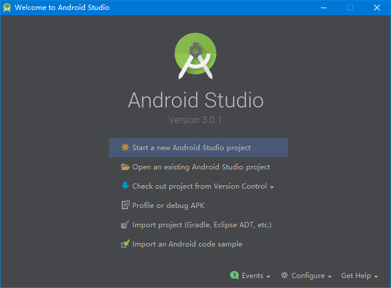
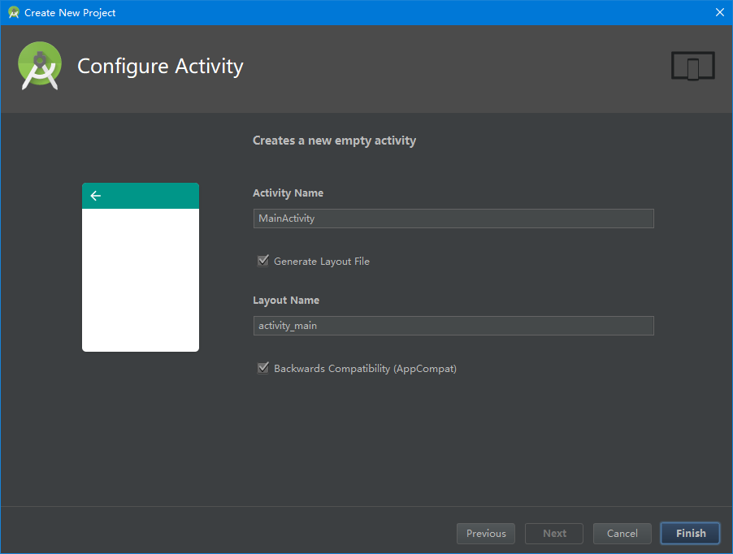

# 创建 Android 项目

_ _ _
编写：[小小的世界](https://github.com/Hcfant) 

日期：December 16, 2017 3:55 PM 

开源目录：[/Hcfant/Android-Studio-3.0-Training/blob/master/第一章/1.1.1.md](https://github.com/Hcfant/Android-Studio-3.0-Training/blob/master/%E7%AC%AC%E4%B8%80%E7%AB%A0/1.1.1.md) 

原文：[https://developer.android.com/training/basics/firstapp/creating-project.html](https://developer.android.com/training/basics/firstapp/creating-project.html) 

本文说明：本课将向您介绍如何使用 Android Studio 创建新的 Android 项目并说明该项目中的一些文件。
_ _ _
## 使用Android Studio创建项目
1.在 **Welcome to Android Studio** 窗口中，点击 **Start a new Android Studio project**。

或者如果您已打开项目，请选择**File > New Project**。

2.在 **New Project** 屏幕中，输入以下值：

-    **Application Name：**“My First App” 
>此处填写想呈现给用户的应用名称。

-    **Company Domain：**“example.com” 
>包名限定符，Android Studio会将这个限定符应用于每个新建的Android项目。

-    **Project location：**{默认}
>操作系统存放项目的目录,您可能需要更改项目位置，但无需更改其他选项。

-    **Package Name：**{默认}
>Package Name是应用的包命名空间（同Java的包的概念），该包名在同一Android系统上所有已安装的应用中具有唯一性，我们可以独立地编辑该包名。

3.点击 **Next**。

4.在 **Target Android Devices** 屏幕中，保留默认值并点击 **Next**。
> 不要勾选其他选项 ( Wear, TV, Android Auto, Android Things) 

5.在 **Add an Activity to Mobile** 屏幕中，选择 **Empty Activity**，然后点击 **Next**。

6.在 **Configure Activity** 屏幕中，保留默认值并点击 **Finish**。

7.经过一些处理后，Android Studio 将打开 IDE。

下面让我们花一点时间了解一下最重要的文件。

首先，请确保已打开 **Project** 窗口（选择 **View > Tool Windows > Project** ），并从窗口顶部的下拉列表中选择Android视图。

随后，您可以看到下列文件：

**app > manifests > AndroidManifest.xml**

> manifest 文件描述应用的基本特性并定义其每个组件。

**app > java > com.example.myfirstapp > MainActivity.java**

> 这是主 Activity（您的应用的入口点）。当您构建和运行应用时，系统会启动此 Activity 的实例并加载其布局。

**app > res > layout > activity_main.xml**

> 此 XML 文件会定义 Activity 界面的布局。它包含一个带有文本“Hello world!”的 TextView 元素。

**Gradle Scripts > build.gradle**

> 您会看到具有此名称的两个文件：一个用于项目，一个用于“应用”模块。每个模块均有自己的 build.gradle 文件，但此项目当前仅有一个模块。您将主要使用模块的 build.gradle 文件配置 Gradle 工具编译和构建您的应用的方式。如需了解有关此文件的更多信息，请参阅配置构建。

要运行该应用，请继续学习下一课。

> > 本文未完成的:

> > 1、部分链接未添加

> > 2、图片目前是引用

> > 3、右上角应添加一个 本章节目录 和上一课 下一课链接导航
