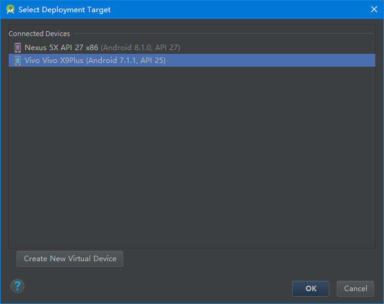

# 执行Android程序

_ _ _
编写：[小小的世界](https://github.com/Hcfant) 

日期：December 22, 2017 8:41 AM 

开源目录：[/Hcfant/Android-Studio-3.0-Training/blob/master/第一章/1.1.2.md](https://github.com/Hcfant/Android-Studio-3.0-Training/blob/master/%E7%AC%AC%E4%B8%80%E7%AB%A0/1.1.2.md) 

原文：[https://developer.android.com/training/basics/firstapp/running-app.html](https://developer.android.com/training/basics/firstapp/running-app.html) 
_ _ _
本课内容：我们在真实设备或模拟器上运行应用。

## 在真实设备上运行
按照以下步骤设置您的设备：
1.使用一根USB电缆将您的设备连接到您的开发机器。如果您是在Windows上开发，可能需要为您的设备安装相应的USB驱动程序。

2.按照以下步骤操作，在**开发者选项**(Developer options)中启用**USB调试**（USB debugging）。
>	首先，您必须开启开发者选项：
>	1.打开**设置**(Settings)应用。
>	2.选择**系统**（System）（仅在Android 8.0或更高版本上）。
>	3.滚动到底部，然后选择**关于手机**（about phone）。
>	4.滚动到底部，点按**版本号**（Build number）7次。
>	5.返回上一屏幕，在底部附近可找到**开发者选项**（Developer options）。
>	6.打开**开发者选项**(Developer options)，然后向下滚动以找到并启用**USB调试**（USB debugging）。

按照以下步骤操作，在您的设备上运行应用：
1.在Android studio 中，点击project 窗口中的app模块，然后选择Run > Run （或点击工具栏中的 Run ）。
2.在Select Deployment Target 窗口中，选择您的设备，然后点击OK。

Android studio 会在您连接的设备上安装并启动应用。

至此，"hello world"将在您的设备上运行！要开始开发应用，请继续学习[下一课](1.1.3链接)。

## 在模拟器上运行
按照以下步骤操作，在模拟器上运行应用：
1.在Android studio 中，点击project 窗口中的app模块，然后选择Run > Run （或点击工具栏中的 Run ）。
2.在Select Deployment Target 对话框中，选择您的模拟器设备，然后点击OK。

Android studio 会在您连接的模拟器上安装并启动应用。

至此，"hello world"将在您的模拟器上运行！要开始开发应用，请继续学习[下一课](1.1.3链接)。