# 构建简单的界面

_ _ _
编写：[小小的世界](https://github.com/Hcfant)<br/>

日期：December 22, 2017 11:15 AM<br/>

开源目录：[/Hcfant/Android-Studio-3.0-Training/blob/master/第一章/1.1.2.md](https://github.com/Hcfant/Android-Studio-3.0-Training/blob/master/%E7%AC%AC%E4%B8%80%E7%AB%A0/1.1.2.md)<br/>

原文：[https://developer.android.com/training/basics/firstapp/building-ui.html](https://developer.android.com/training/basics/firstapp/building-ui.html)<br/>
_ _ _
本课内容：您将使用Android studio layout editor 创建一个布局，其中包括一个文本框和一个按钮。

知识点：
Android 应用的界面使用布局（ViewGroup对象）和微件（View对象）层次结构构建。
布局是一种不可见的容器，用于控制其子视图在屏幕上的位置。
微件是界面组件，例如按钮和文本框。


Android 为ViewGroup和View类提供了一个XML词汇，因此您的大多数界面都在XML文件中定义。
不过，本课将向您介绍如何使用Android studio layout editor创建布局，而不是教你编写一些XML代码。
在布局编辑器中，只需拖放视图即可构建布局，大大简化了构建工作。

## 打开布局编辑器
> 注：本课假想您使用Android studio 3.0.1，并且已完成上一课创建Android项目的学习。

首先，请按照以下步骤设置您的工作区：
1.在Android studio 的project窗口中，打开app > res > layout > activity_main.xml。
2.要为布局编辑器流出更多空间（如果您的显示器足够大可以忽略），请选择 View > Tool Windows > Project 以隐藏 Project 窗口，或者点击 Android Studio 左侧的 Project ）。
3.如果您的编辑器显示 XML 源代码，请点击窗口底部的 Design 标签。
4.点击 Select Design Surface并选择 Blueprint。
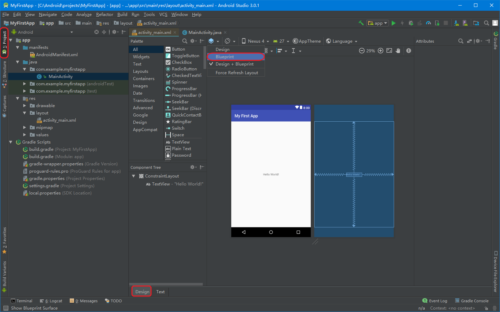
5.点击工具栏中的 Show 并确保选中 Show Constraints。
6.确保 Autoconnect 关闭。工具栏中的提示应为 Turn On Autoconnect （因为它现在处于关闭状态）。
7.点击工具栏中的 Default Margins，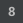然后选择 16（您稍后仍然可以调整每个视图的外边距）。
8.点击工具栏中的 Device in Editor，然后选择 Pixel XL。

此时，您的编辑器现在应如图所示。（小编这里没有隐藏Project 窗口）
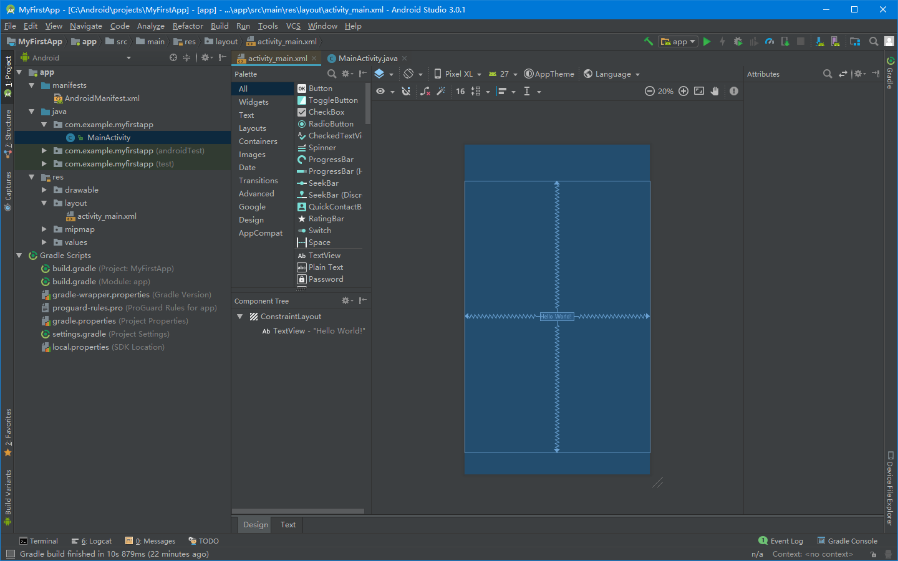

左下方的 Component Tree 窗口显示布局的视图层次结构。在本例中，根视图是 ConstraintLayout，仅包含一个 TextView 对象。
> ConstraintLayout 是一种布局，它根据同级视图和父布局的约束条件为每个视图定义位置。
> 这样一来，您可以创建具有扁平视图层次结构的简单布局和复杂布局。
> 也就是说，它可以避免对嵌套布局（布局内的布局，如图 2 所示）的需求，嵌套布局会增加绘制界面所需的时间。

## 添加一个文本框
1.首先，您需要移除布局中已有的内容。因此，请点击 Component Tree 窗口中的 TextView，然后按 Delete。
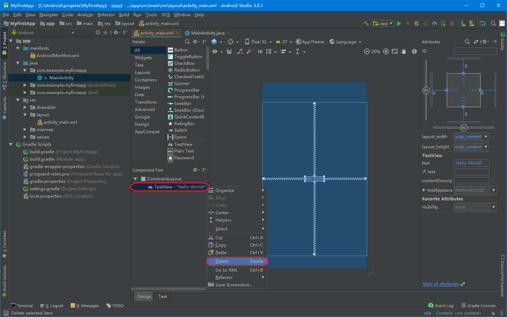
2.在左侧的 Palette 窗口中，点击左侧窗格中的 Text，然后将 Plain Text 拖放到设计编辑器中靠近布局顶部的位置。这是一个接受纯文本输入的 EditText 微件。
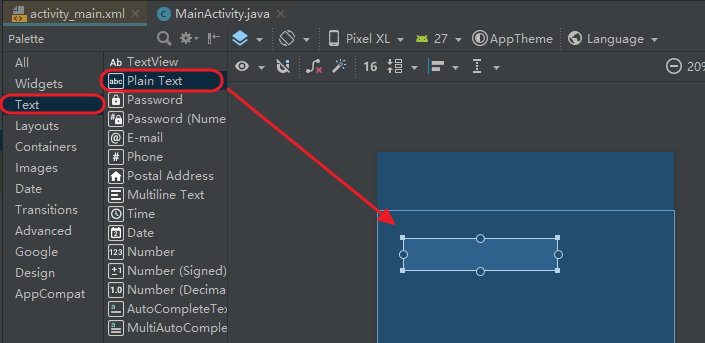
3.在设计编辑器中点击视图。现在，您可以在每个角上看到大小调整手柄（正方形），并在每个边上看到约束锚点（圆形）。为了能更好的控制，您可能需要使用工具栏的按钮放大编辑器。
4.点击并按住定边的锚点（圆形），将其向上拖动，直至锚点吸附到布局的顶部，然后释放。
> 这是一个约束条件——它指定视图应位于距离布局顶部16dp的位置（因为您将默认外边距设置为16dp）。

5.类似地，从视图左侧创建一个约束条件，将其限制在布局左侧。
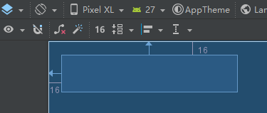

## 添加一个按钮
1.在 Palette 窗口中，点击左侧窗格中的 Widgets，然后将 Button 拖放到设计编辑器中靠近右侧的位置。
2.从按钮左侧创建一个约束条件，将其限制在文本框的右侧。
3.要在水平对齐中约束视图，您需要在文本基线之间创建一个约束条件。因此，请点击按钮，然后点击 Edit Baseline，它将显示在设计编辑器中选定视图的正下方。基线锚点显示在按钮内部。点击并按住此锚点，然后将其拖动到文本框中显示的基线锚点。
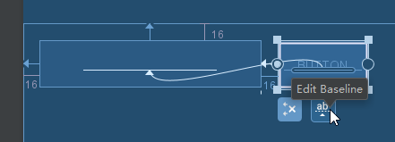

## 更改界面字符串
要预览界面，请点击工具栏中的select design surface并选择Design。
请注意，默认设置下，文本输入使用"Name"预填充，按钮标记为"Button"。
现在，您将可以按照以下步骤更改这些字符串。
1.打开Project窗口，然后打开app > res > values > strings.xml。
> 这是一个字符串资源文件，您应该在这个文件中指定所有界面字符串。
> 这样您可以在一个位置管理所有界面字符串，让字符串的查找、更新和本地化变得更加容易（与您的布局或应用代码中的硬编码字符串相比）。

2.点击编辑器窗口顶部的Open editor 。打开Translations Editor，这里提供了一个可以添加和编辑字符串的简单界面，方便您管理您的字符串资源。
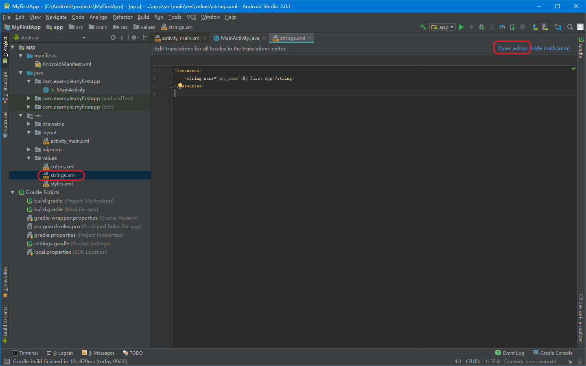
3.点击Add Key
-    以文本框"提示文本"的形式创建新字符串。
-    key:"edit_message"。
-    default value："Enter a message"。
-    点击OK。
-    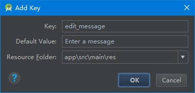


-    再添加一个名称为"button_send"，值为"Send"的键。
-    key:"button_send"。
-    default value："Send"。
-    点击OK。
-    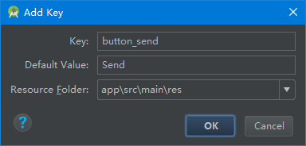

现在，您可以为每个视图设置这些字符串。点击标签栏中的 activity_main.xml 以返回布局文件，然后按照以下步骤添加字符串：
1.点击布局中的**文本框**
>（如果 Attributes 窗口在右侧还未显示，请点击右侧边栏上的 Attributes）。

2.找到 text 属性（当前设为“Name”）并删除值。
3.找到 hint 属性，然后点击文本框右侧的Pick a Resource。在出现的对话框中，双击列表中的 edit_message。
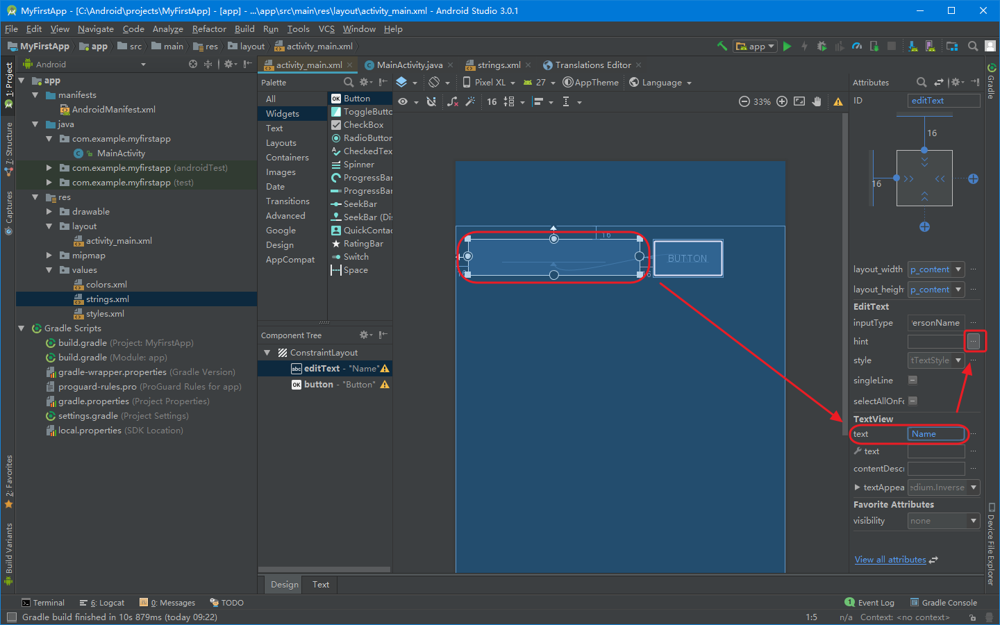
4.现在，点击布局中的**按钮**，找到 text 属性，点击Pick a Resource，在出现的对话框中，双击列表中的 button_send。

## 让文本框大小灵活调整
要创建一个可以适应不同尺寸的布局，您现在可以让文本框拉伸以填充剩余的所有水平空间（扣除按钮和所有外边距后的空间）。

首先点击工具栏中的**Show**并选择**Blueprint**。
1.选中**文本框**和**按钮**（选中一个，按住Shift键并点击另一个；此外还可以用鼠标直接拉选。）然后右键点击任何一个组件并选择 Chain > Create Horizontal Chain。
> 链是两个或更多视图之间的双向约束条件，它让您可以采用一致的方式放置链接的视图。

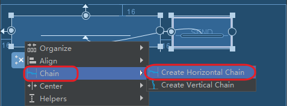

2.选择**按钮**并打开 Attributes 窗口。使用 Attributes 窗口顶部的视图检查器将右外边距设置为 16。
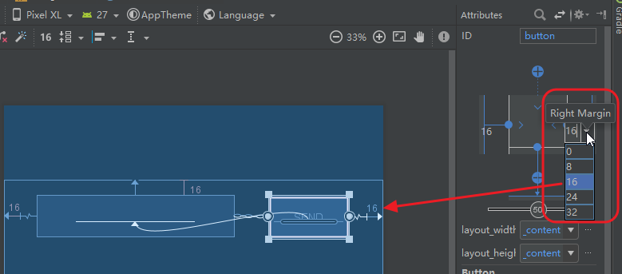

3.现在，点击**文本框**以查看其属性。点击两次宽度指示器，确保将其设置为 Match Constraints。
> “Match constraints”表示宽度将延长以符合水平约束条件和外边距的定义。因此，文本框将拉伸以填充水平空间（扣除按钮和所有外边距后的空间）。

现在，布局已经完成
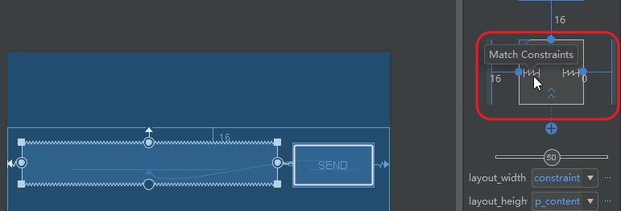

现在，您可以运行应用。或者继续学习下一课。

如果您的布局没有按照预计的效果显示，可以查看您的XML代码与以下代码进行比较。
(如果您的属性以不同顺序显示，这是没有问题的。）
app/res/values/strings.xml
```language
<?xml version="1.0" encoding="utf-8"?>
<android.support.constraint.ConstraintLayout xmlns:android="http://schemas.android.com/apk/res/android"
    xmlns:app="http://schemas.android.com/apk/res-auto"
    xmlns:tools="http://schemas.android.com/tools"
    android:layout_width="match_parent"
    android:layout_height="match_parent"
    tools:context="com.example.myfirstapp.MainActivity">
    <EditText
        android:id="@+id/editText"
        android:layout_width="0dp"
        android:layout_height="wrap_content"
        android:layout_marginStart="16dp"
        android:layout_marginTop="16dp"
        android:ems="10"
        android:hint="@string/edit_message"
        android:inputType="textPersonName"
        app:layout_constraintEnd_toStartOf="@+id/button"
        app:layout_constraintHorizontal_bias="0.5"
        app:layout_constraintStart_toStartOf="parent"
        app:layout_constraintTop_toTopOf="parent" />
    <Button
        android:id="@+id/button"
        android:layout_width="wrap_content"
        android:layout_height="wrap_content"
        android:layout_marginEnd="16dp"
        android:layout_marginStart="16dp"
        android:text="@string/button_send"
        app:layout_constraintBaseline_toBaselineOf="@+id/editText"
        app:layout_constraintEnd_toEndOf="parent"
        app:layout_constraintHorizontal_bias="0.5"
        app:layout_constraintStart_toEndOf="@+id/editText" />
</android.support.constraint.ConstraintLayout>
```
