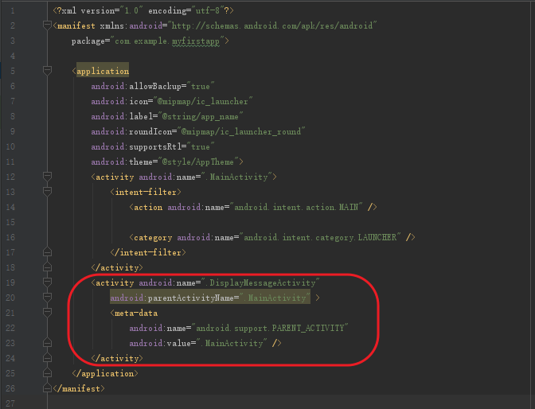
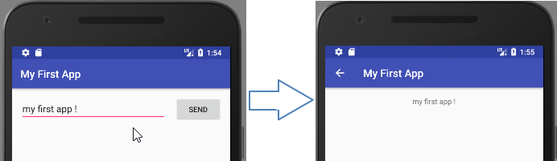

# 启动另一个Activity

_ _ _
编写：[小小的世界](https://github.com/Hcfant)<br/>

日期：December 22, 2017 11:15 AM<br/>

开源目录：[/Hcfant/Android-Studio-3.0-Training/blob/master/第一章/1.1.2.md](https://github.com/Hcfant/Android-Studio-3.0-Training/blob/master/%E7%AC%AC%E4%B8%80%E7%AB%A0/1.1.2.md)<br/>

原文：[https://developer.android.com/training/basics/firstapp/starting-activity.html](https://developer.android.com/training/basics/firstapp/starting-activity.html)<br/>
_ _ _
本课内容：向MainActivity.java添加一些代码，这些代码可在用户点击Send按钮时启动一个新的Activity来显示信息。

## 响应Send按钮
按照以下步骤操作，在 MainActivity.java 中添加一个由**按钮**调用的函数：
1.在文件 app > java > com.example.myfirstapp > MainActivity.java 中，添加 sendMessage() 函数存根，如下所示：
> 您可能会看到一条错误，因为 Android Studio 无法解析用作函数参数的 View 类。因此，请点击，将您的光标放置在 View 声明上，然后按 Alt + Enter（在 Mac 上，则按 Option + Return），执行快速修复。（如果出现一个菜单，请选择 Import class。）

```language
public class MainActivity extends AppCompatActivity {

    @Override
    protected void onCreate(Bundle savedInstanceState) {
        super.onCreate(savedInstanceState);
        setContentView(R.layout.activity_main);
    }
    /** Called when the user taps the Send button */
    public void sendMessage(View view){
    }
}
```
2.现在，返回到 activity_main.xml 文件，从**按钮**调用此函数：
在布局编辑器中，点击选择**按钮**，在Attributes窗口中，找到onClick属性并从下拉列表中选择sendMessage[MainActivity]。


现在，当用户点击按钮时，系统将调用sendMessage()函数。

## 构建一个 Intent
Intent 是指在相互独立的组件（如两个 Activity）之间提供运行时绑定功能的对象。
Intent 表示一个应用“执行某项操作的意向”。
intent 可用于各种任务，但在本课中将用于启动另一个Activity。

在 MainActivity.java 中，添加 EXTRA_MESSAGE 常量和 sendMessage() 代码，如此处所示：
```language
public class MainActivity extends AppCompatActivity {
    public static final String EXTRA_MESSAGE = "com.example.myfirstapp.MESSAGE";
    @Override
    protected void onCreate(Bundle savedInstanceState) {
        super.onCreate(savedInstanceState);
        setContentView(R.layout.activity_main);
    }

    /** Called when the user taps the Send button */
    public void sendMessage(View view) {
        Intent intent = new Intent(this, DisplayMessageActivity.class);
        EditText editText = (EditText) findViewById(R.id.editText);
        String message = editText.getText().toString();
        intent.putExtra(EXTRA_MESSAGE, message);
        startActivity(intent);
    }
}
```
Android Studio 将再次遇到 Cannot resolve symbol 错误，因此，请按 Alt + Enter（在 Mac 上，则按 Option + Return），执行快速修复。（如果出现一个菜单，请选择 Import class。）。您的导入应按如下所示方式结束：
```language
import android.content.Intent;
import android.support.v7.app.AppCompatActivity;
import android.os.Bundle;
import android.view.View;
import android.widget.EditText;
```

DisplayMessageActivity 仍有错误，但没关系；您将在下一部分中修复该错误。
下面是 sendMessage() 中的操作：

> Intent 构造函数采用两个参数：
>> Context 是第一个参数（之所以使用 this 是因为 Activity 类是 Context 的子类）

>>应用组件的 Class，系统应将 Intent（在本例中，为应启动的 Activity）传递至该类。

>putExtra() 函数将 EditText 的值添加到 intent。

>Intent 能够以名为 extra 的键值对形式携带数据类型。

>您的键是一个公共常量 EXTRA_MESSAGE，因为下一个 Activity 将使用该键来检索文本值。

>为 intent extra 定义键时最好使用应用的软件包名称作为前缀。

>这可以确保在您的应用与其他应用交互时这些键始终保持唯一。

>startActivity() 函数将启动 Intent 指定的 DisplayMessageActivity 实例。现在，您需要创建该类。

## 创建第二个 Activity
1.在 Project 窗口中，右键点击 app 文件夹并选择 New > Activity > Empty Activity。

2.在 Configure Activity 窗口中，为 Activity Name 输入“DisplayMessageActivity”，然后点击 Finish（保留所有其他属性设置为默认值）。
Android Studio 会自动执行三项操作：
-	创建 DisplayMessageActivity.java 文件。
-	创建对应的 activity_display_message.xml 布局文件。
-	在 AndroidManifest.xml 中添加必需的 <activity> 元素。


如果运行应用并在第一个 Activity 上点按**按钮**，将启动第二个 Activity，但它为空。这是因为第二个 Activity 使用模板提供的空布局。

## 添加文本视图
新 Activity 包括一个空白的布局文件，因此，现在您需要在消息将要显示的位置添加一个文本视图。

1.打开文件 app > res > layout > activity_display_message.xml。

2.点击工具栏中的Turn On Autoconnect，启用后的Autoconnect应显示为。

3.在 Palette 窗口中，点击 Text，然后将 TextView 拖动到布局中 - 将其放置在靠近布局顶部中心的位置，使其吸附到出现的垂直线上。Autoconnect 将添加左侧和右侧约束条件，在水平中心放置视图。


4.再从文本视图的顶部创建一个约束条件，将其限制在布局顶部。

> 此时也可以在 Attributes 窗口中展开 textAppearance 并更改属性（例如 textSize 和 textColor），对文本样式进行一些调整。

## 显示消息
现在，您将修改第二个 Activity，以显示第一个 Activity 传递的消息。

1.打开 DisplayMessageActivity.java 文件


2.向 onCreate() 函数添加下列代码：
```language
    // Get the Intent that started this activity and extract the string
    Intent intent = getIntent();
    String message = intent.getStringExtra(MainActivity.EXTRA_MESSAGE);

    // Capture the layout's TextView and set the string as its text
    TextView textView = findViewById(R.id.textView);
    textView.setText(message);
```

Android Studio 将再次遇到 Cannot resolve symbol 错误，因此，请按 Alt + Enter（在 Mac 上，则按 Option + Return），执行快速修复。（如果出现一个菜单，请选择 Import class。）。


2.随后应按如下所示方式结束：
```language
package com.example.myfirstapp;

import android.content.Intent;
import android.support.v7.app.AppCompatActivity;
import android.os.Bundle;
import android.widget.TextView;

public class DisplayMessageActivity extends AppCompatActivity {

    @Override
    protected void onCreate(Bundle savedInstanceState) {
        super.onCreate(savedInstanceState);
        setContentView(R.layout.activity_display_message);

        // Get the Intent that started this activity and extract the string
        Intent intent = getIntent();
        String message = intent.getStringExtra(MainActivity.EXTRA_MESSAGE);

        // Capture the layout's TextView and set the string as its text
        TextView textView = findViewById(R.id.textView);
        textView.setText(message);

    }
}
```


## 添加向上导航
您的应用中不是主入口的每个屏幕（所有不是主屏幕的屏幕）都应提供导航，以便用户在应用栏中点按“向上”按钮后可以返回应用层次结构中的逻辑父屏幕。

您需要做的全部工作是在 AndroidManifest.xml 文件中声明哪个 Activity 是逻辑父项。
因此，请打开 app > manifests > AndroidManifest.xml 处的文件，找到 DisplayMessageActivity 的 <activity> 标记。


然后将其替换为以下代码：

```language
<activity android:name=".DisplayMessageActivity"
          android:parentActivityName=".MainActivity" >
    <!-- The meta-data tag is required if you support API level 15 and lower -->
    <meta-data
        android:name="android.support.PARENT_ACTIVITY"
        android:value=".MainActivity" />
</activity>
```


## 运行应用
现在，点击工具栏中的 Apply Changes，再次运行应用  。当应用打开后，在文本字段中键入一条消息，点按 Send 以在第二个 Activity 中查看显示的消息。


就这么简单，您的第一个 Android 应用已成功诞生！
