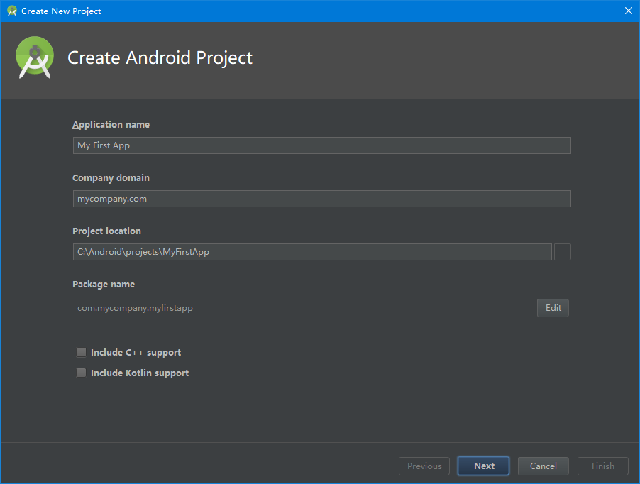
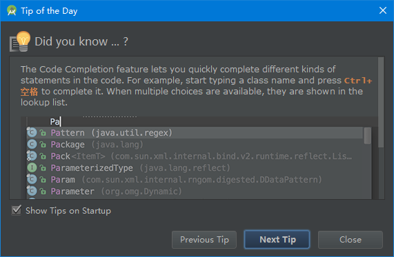

使用Android Studio创建项目

1.使用Android studio创建Android项目，启动Android studio。

如果我们还没有用Android studio 打开过项目，会看到欢迎页，点击**start a new Android studio project**。

如果已经用Android studio 打开过项目，点击菜单中的File，选择New Project来创建一个新的项目。

2.参照图2在弹出的窗口（create Android project）中填入内容，点击Next。
-	按照如图所示的值进行填写，会使得后续的操作步骤不容易出差错。
-	Application name：“My First App”
-	注释：此处填写想呈现给用户的应用名称
-	company domain：“mycompany.com”
-	注释：包名限定符，Android Studio会将这个限定符应用于每个新建的Android项目。
-	project location：默认
-	注释：操作系统存放项目的目录。
-	package name：默认
-	注释：是应用的包命名空间（同Java的包的概念），该包名在同一Android系统上所有已安装的应用中具有唯一性，我们可以独立地编辑该包名。
-    [ ] include c++ support
-    [ ] include kontlin support

3.在target Android studio devices窗口勾选phone and tablet，不要勾选其他选项（wear、TV、Android auto、Android things），点击next。

4.在add an activity to mobile 窗口选择basic activity，点击next。

5.在configure activity窗口中填入以下内容，点击Finish完成创建。
-	Activity Name：“MyActivity”
-	Layout Name：“activity_my”
-	Title：“MyActivity”

6.创建完成后，你可能会看到一个每日提示的窗口。

- - -
刚创建的Android项目是一个基础的Hello World项目，包含一些默认文件，我们花一点时间看看最重要的部分：

app/res/layout/activity_my.xml

这是刚才用Android Studio创建项目时新建的Activity对应的xml布局文件，按照创建新项目的流程，Android Studio会同时展示这个文件的文本视图和图形化预览视图，该文件包含一些默认设置和一个显示内容为“Hello world!”的TextView元素。

app/java/com.mycompany.myfirstapp/MyActivity.java

用Android Studio创建新项目完成后，可在Android Studio看到该文件对应的选项卡，选中该选项卡，可以看到刚创建的Activity类的定义。编译并运行该项目后，Activity启动并加载布局文件activity_my.xml，显示一条文本："Hello world!"

app/manifests/AndroidManifest.xml

manifest文件描述了项目的基本特征并列出了组成应用的各个组件，接下来的学习会更深入了解这个文件并添加更多组件到该文件中。

gradle scripts

Android Studio使用Gradle 编译运行Android工程. 工程的每个模块以及整个工程都有一个build.gradle文件。