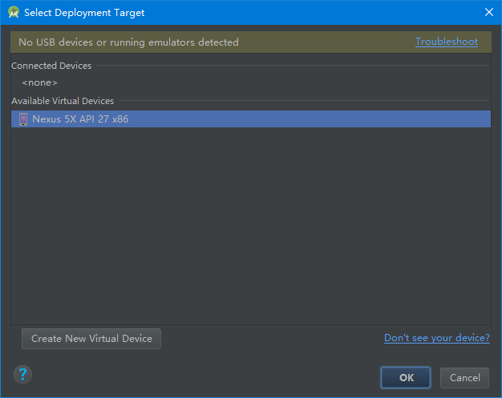

# 执行Android 程序

## 在模拟器上运行
-	1.选择项目的一个文件，点击工具栏里的run按钮（图标：），或者按下快捷键Shift+F10也可以实现该步骤。
-	2.select deployment target窗口出现时，从Android virtual device下拉菜单选择模拟器，点击OK；

模拟器启动可能需要几分钟的时间，启动完成后，解锁即可看到程序已经运行到模拟器屏幕上了。

## 在真实设备上运行
