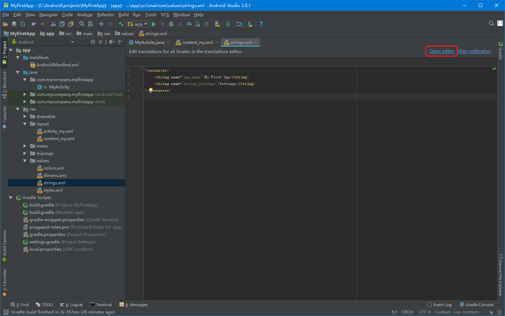
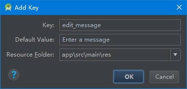
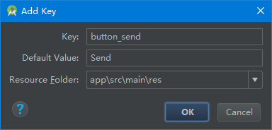
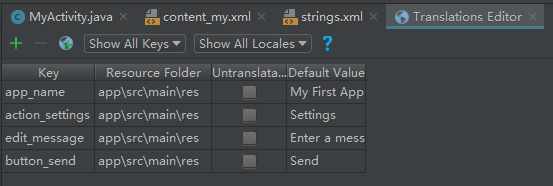

# 建立简单的用户界面
本节内容：我们将学习如何用XML创建一个带有文本输入框和按钮的界面。

## 修改content_my.xml文件
1.上一节创建新项目时包含一个 content_my.xml 文件，该文件根元素是一个包含 TextView 的 ConstraintLayout。
2.在


## 添加一个文本输入框
在content_my.xml文件的&lt;ConstraintLayout>标签内部定义一个&lt;EditText>标签：
1.设置 id 属性为 “@+id/edit_message”。
2.设置 layout_width 和 layout_height 属性为 “wrap_content”。
3.设置 hint 属性为一个名为 “@string/edit_message” 的字符串。
代码如下：
res/layout/content_my.xml
```
<EditText android:id="@+id/edit_message"
android:layout_width="wrap_content"
android:layout_height="wrap_content"
android:hint="@string/edit_message" />
```

各属性说明：
android:id
> 这是视图的唯一标识符。可以在程序代码中通过标识符引用对象。
> 例如对这个对象进行读和修改的操作。

android:layout_width 和 android:layout_height
> 不建议置顶宽度和高度的具体尺寸，应使用“wrap_content”。因为这样可以保证视图只占据内容大小的空间。
> 如果你使用了“match_parent”，这时EditText将会布满整个屏幕，因为它将适应父布局的大小。
> 参见[布局向导](https://developer.android.com/guide/topics/ui/declaring-layout.html)。


android:hint
> 当文本框为空的时候，会默认显示这个字符串。
> 对于字符串“@string/edit_message”的值所引用的资源应该定义在单独的文件里，而不是直接使用字符串。因为使用的值是存在的资源，所以不需要使用+号。当然，由于你现在还没有定义字符串，所以在添加“@string/edit_message”的时候出现编译错误。在下一节的教程中你将学会如何定义字符串资源，到时候就不会报错了。

## 自定义字符串资源

#### 增加字符串资源 方法一
-    打开project窗口，然后双击打开app > res > values > strings.xml。
-    添加一个名为“edit_message”的字符串，值为“Enter a message”。
-    再添加一个名为“button_send”的字符串，值为“Send”。
下面就是修改好的 res/valuse/strings.xml：
```
<resources>
    <string name="app_name">My First App</string>
    <string name="action_settings">Settings</string>
    <string name="edit_message">Enter a message</string>
    <string name="button_send">Send</string>
</resources>
```

#### 增加字符串资源 方法二

1.打开project窗口，然后双击打开app > res > values > strings.xml。

-    这是一个字符串资源文件，您应该在这个文件中指定所有界面字符串。

-    这样您可以在一个位置管理所有界面字符串，让字符串的查找、更新和本地化变得更加容易（与您的布局或应用代码中的硬编码字符串相比）。


2.点击编辑器窗口顶部的 open editor。这将打开Translations Editor窗口



3.在Translations Editor窗口点击Add Key（图标）
-    以文本框“提示文本”的形式创建新字符串。
-    key:“edit_message”。
-    default value：“Enter a message”。
-    点击OK。
-    


-    再添加一个名称为“button_send”，值为“Send”的键。
-    key:“button_send”。
-    default value：“Send”。
-    点击OK。
-    
完成后如图


- - -

## 添加一个按钮
在content_my.xml文件的&lt;ConstraintLayout>标签内部的&lt;EditText>标签之后定义一个&lt;Button>标签。
1.设置按钮的width和height属性值为“wrap_content”。
> 宽和高被设置为“wrap_content”，以便让按钮的大小能完整显示文字，这里按钮占据的大小就是按钮里文本的大小。
> 此时这个按钮不需要指定android:id的属性，因为Activity代码中不会引用该Button。

2.定义按钮的文本使用android:text属性，设置值为相似上一节中定义好的“button_send”字符串资源。


此时的&lt;ConstraintLayout>看起来应该是这样：

res/layout/content_my.xml
```
<android.support.constraint.ConstraintLayout xmlns:android="http://schemas.android.com/apk/res/android"
    xmlns:app="http://schemas.android.com/apk/res-auto"
    xmlns:tools="http://schemas.android.com/tools"
    android:layout_width="match_parent"
    android:layout_height="match_parent"
    app:layout_behavior="@string/appbar_scrolling_view_behavior"
    tools:context="com.mycompany.myfirstapp.MyActivity"
    tools:showIn="@layout/activity_my">

    <EditText android:id="@+id/edit_message"
        android:layout_width="wrap_content"
        android:layout_height="wrap_content"
        android:hint="@string/edit_message" />

    <Button
        android:layout_width="wrap_content"
        android:layout_height="wrap_content"
        android:text="@string/button_send" />

</android.support.constraint.ConstraintLayout>
```


<!--
1.在Android studio中，从app/res/layout目录双击打开content_my.xml文件，并切换到Text窗口。

2.preview面板点击图标关闭右侧Preview面板。

3.删除 TextView 标签。
-->

