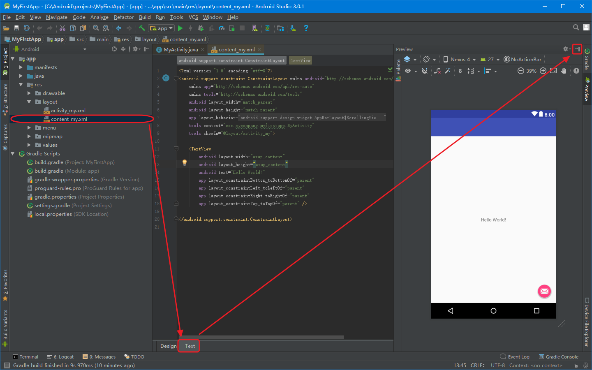

# 建立简单的用户界面
本节内容：我们将学习如何用XML创建一个带有文本输入框和按钮的界面。

## 创建一个 LinearLayout
1.双击打开 app > res > layout > content_my.xml 文件，并切换到Text编辑视图。
2.在Preview面板点击关闭右侧Preview面板。
> 在Android studio中打开布局文件时，可以看到一个Preview面板。
> 点击这个面板中的标签，可利用WYSIWYG（所见即所得）工具在Design面板看到对应的图形化效果。
> 但在本节中，我们将学习如何直接修改XML文件。



3.把&lt;android.support.constraint.ConstraintLayout>标签改为&lt;LinearLayout>。

4.删除&lt;TextView>标签。

5.去掉tools:context属性。

6.添加android:orientation属性，值为"horizontal"。

修改后结果如下：
res/layout/content_my.xml
```
<LinearLayout xmlns:android="http://schemas.android.com/apk/res/android"
    xmlns:app="http://schemas.android.com/apk/res-auto"
    xmlns:tools="http://schemas.android.com/tools"
    android:layout_width="match_parent"
    android:layout_height="match_parent"
    app:layout_behavior="@string/appbar_scrolling_view_behavior"
    tools:showIn="@layout/activity_my"
    android:orientation="horizontal">
    
</LinearLayout>
```
> LinearLayout是ViewGroup的子类，用于放置水平或垂直方向的子视图部件，放置方向由属性android:orientation决定。
> LinearLayout里的子布局按照XML里定义的顺序显示在屏幕上。

> 所有的 Views 都会用到 android:layout_width 和 android:layout_height 这两个属性来设置自身的大小。

> 由于 LinearLayout 是整个视图的根布局，所以通过指定 width 和 height 属性为 "match_parent" 可以使其宽度和高度充满整个屏幕。该值表示子 View 扩张自己宽度和高度来 匹配 父控件的宽度和高度。

> 更多关于布局属性的内容，请参考[布局向导]()。

## 添加一个文本输入框
与其他View一样，我们需要定义XML里的某些属性来指定EditText的属性值。以下是应该在[线性布局]()里指定的一些属性元素：

在content_my.xml文件的&lt;LinearLayout>标签内部定义一个&lt;EditText>标签：
-	设置 id 属性为 "@+id/edit_message"。
-	设置 layout_width 和 layout_height 属性为 "wrap_content"。
-	设置 hint 属性为一个名为 "@string/edit_message" 的字符串。

代码如下：

res/layout/content_my.xml
```
<EditText android:id="@+id/edit_message"
android:layout_width="wrap_content"
android:layout_height="wrap_content"
android:hint="@string/edit_message" />
```

各属性说明：

android:id
> 这是视图的唯一标识符。可以在程序代码中通过标识符引用对象。
> 例如对这个对象进行读和修改的操作。

android:layout_width 和 android:layout_height
> 不建议置顶宽度和高度的具体尺寸，应使用"wrap_content"。因为这样可以保证视图只占据内容大小的空间。
> 如果你使用了"match_parent"，这时EditText将会布满整个屏幕，因为它将适应父布局的大小。
> 参见[布局向导](https://developer.android.com/guide/topics/ui/declaring-layout.html)。

android:hint
> 当文本框为空的时候，会默认显示这个字符串。
> 对于字符串"@string/edit_message"的值所引用的资源应该定义在单独的文件里，而不是直接使用字符串。因为使用的值是存在的资源，所以不需要使用+号。当然，由于你现在还没有定义字符串，所以在添加"@string/edit_message"的时候出现编译错误。在下一节的教程中你将学会如何定义字符串资源，到时候就不会报错了。

## 自定义字符串资源

#### 增加字符串资源 方法一
-    打开project窗口，然后双击打开app > res > values > strings.xml。
-    添加一个名为"edit_message"的字符串，值为"Enter a message"。
-    再添加一个名为"button_send"的字符串，值为"Send"。
下面就是修改好的 res/valuse/strings.xml：
```
<resources>
    <string name="app_name">My First App</string>
    <string name="action_settings">Settings</string>
    <string name="edit_message">Enter a message</string>
    <string name="button_send">Send</string>
</resources>
```

#### 增加字符串资源 方法二

1.打开project窗口，然后双击打开app > res > values > strings.xml。

-    这是一个字符串资源文件，您应该在这个文件中指定所有界面字符串。

-    这样您可以在一个位置管理所有界面字符串，让字符串的查找、更新和本地化变得更加容易（与您的布局或应用代码中的硬编码字符串相比）。


2.点击编辑器窗口顶部的 open editor。这将打开Translations Editor窗口


3.在Translations Editor窗口点击Add Key（图标）
-    以文本框"提示文本"的形式创建新字符串。
-    key:"edit_message"。
-    default value："Enter a message"。
-    点击OK。
-    


-    再添加一个名称为"button_send"，值为"Send"的键。
-    key:"button_send"。
-    default value："Send"。
-    点击OK。
-    

-    完成后如图
-    

- - -

## 添加一个按钮
在content_my.xml文件的&lt;LinearLayout>标签内部的&lt;EditText>标签之后定义一个&lt;Button>标签。
1.设置按钮的width和height属性值为"wrap_content"。
> 宽和高被设置为"wrap_content"，以便让按钮的大小能完整显示文字，这里按钮占据的大小就是按钮里文本的大小。
> 此时这个按钮不需要指定android:id的属性，因为Activity代码中不会引用该Button。

2.定义按钮的文本使用android:text属性，设置值为相似上一节中定义好的"button_send"字符串资源。


此时的&lt;LinearLayout>看起来应该是这样：

res/layout/content_my.xml
```
<LinearLayout xmlns:android="http://schemas.android.com/apk/res/android"
    xmlns:app="http://schemas.android.com/apk/res-auto"
    xmlns:tools="http://schemas.android.com/tools"
    android:layout_width="match_parent"
    android:layout_height="match_parent"
    app:layout_behavior="@string/appbar_scrolling_view_behavior"
    tools:context="com.mycompany.myfirstapp.MyActivity"
    tools:showIn="@layout/activity_my">

    <EditText android:id="@+id/edit_message"
        android:layout_width="wrap_content"
        android:layout_height="wrap_content"
        android:hint="@string/edit_message" />

    <Button
        android:layout_width="wrap_content"
        android:layout_height="wrap_content"
        android:text="@string/button_send" />

</LinearLayout>
```

## 让输入框充满整个屏幕的宽度

为让EditText充满剩余空间，做如下操作：
1.在content_my.xml文件里，设置&lt;EditText>的layout_weight属性值为1。
2.设置&lt;EditText>的layout_width属性值为0dp。
res/layout/content_my.xml
```
android:layout_weight="1"
android:layout_width="0dp"
```
> 为了提升布局的效率，在设置权重时，应该把EditText的宽度设为0dp。
> 如果宽度设置为"wrap_content"，系统需要计算这个部件所占用的宽度；而此时的EditText因为设置了权重，所以占据剩余空间；最终导致的结果是：EditText的宽度成了不起作用的属性。


